# pragma

> Vibetrading for Claude Code

[](https://support.apple.com/macos)
[](https://code.claude.com/docs/en/plugins)
[](https://monad.xyz)
[](CHANGELOG.md)
[](LICENSE)

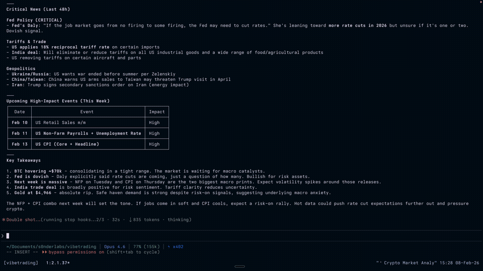

[Watch the demo](https://youtu.be/GRhlMfG2eSk?si=j9Wu6L91Jq6lm0XD)

> **Beta Software.** pragma is experimental and under active development. Trading involves risk of loss — use at your own discretion and never trade more than you can afford to lose.

pragma is a [Claude Code plugin](https://code.claude.com/docs/en/plugins) that turns Claude into an on-chain trading agent. Swap tokens, trade perpetuals, scalp memecoins, analyze markets, and run autonomous trading agents — all through natural conversation.

**Currently live on [Monad](https://monad.xyz).** Built with [MetaMask Smart Accounts Kit](https://docs.metamask.io/smart-accounts-kit/) and [x402](https://www.x402.org/) (pay-per-API-call with USDC — no keys to configure).

> **Currently macOS only.** Works in Claude Code CLI (full experience) and Claude Desktop / Cowork (experimental). pragma uses Touch ID and macOS Keychain for key security — your passkey never leaves your device. This is a deliberate design choice: no server, no cloud, no browser extension. Everything runs locally on your Mac.

### Not another AI wallet

Most AI trading agents work by giving the AI a private key with full control over funds, often on a remote server you don't control. pragma takes a fundamentally different approach: **local execution, delegation, not key sharing.**

|                     | Typical AI Agent                       | pragma                                             |
| ------------------- | -------------------------------------- | -------------------------------------------------- |
| **Execution**       | Remote server you trust                | Locally on your Mac — no backend                   |
| **Key storage**     | Server-side or cloud HSM               | macOS Keychain, never leaves your device           |
| **Key custody**     | AI holds private key                   | You hold the key (Touch ID / passkey)              |
| **Fund location**   | In the AI's wallet                     | In your smart account                              |
| **Permissions**     | Full access, trust-based               | Scoped delegations, on-chain enforced              |
| **Constraints**     | "Please don't spend too much"          | Smart contract caveats (time, budget, targets)     |
| **Revocation**      | Change the key and hope                | Instant on-chain nonce increment                   |
| **Autonomous scope**| Same as manual — unlimited             | Sub-delegations can only narrow, never widen       |

Everything runs on your machine. Keys never leave your device. Your funds never leave your account. Claude operates through [delegations](https://docs.metamask.io/smart-accounts-kit/concepts/delegation/) — signed, on-chain permissions with hard limits that smart contracts enforce. Not the AI's good behavior.

## Table of Contents

- [Features](#features)
- [Installation](#installation)
- [Claude Desktop & Cowork](#claude-desktop--cowork)
- [OpenClaw](#openclaw)
- [Quick Start](#quick-start)
- [Commands](#commands)
- [Modes](#modes)
- [Tools](#tools)
- [How It Works](#how-it-works)
  - [Wallet Architecture](#wallet-architecture)
  - [Passkey and Touch ID](#passkey-and-touch-id)
  - [Session Keys](#session-keys)
  - [Delegations](#delegations)
  - [Assistant vs Autonomous](#assistant-vs-autonomous)
  - [Autonomous Agents](#autonomous-agents)
  - [How Agents Are Spawned](#how-agents-are-spawned)
  - [Security Model](#security-model)
  - [x402 Protocol](#x402-protocol)
- [Production Runs](#production-runs)
- [Pricing](#pricing)
- [Requirements](#requirements)
- [Troubleshooting](#troubleshooting)
- [Acknowledgments](#acknowledgments)
- [Support](#support)
- [License](#license)

---

## Features

**Trading**

- Token swaps via DEX aggregator (best route, batch support)
- Perpetual futures on [LeverUp](https://leverup.xyz) (up to 1001x leverage, 20 pairs)
- Memecoin trading on [nad.fun](https://nad.fun) bonding curves
- Wrapping and transfers

**Market Intelligence**

- OHLCV charts from Pyth oracles (all timeframes)
- Economic calendar, central bank speeches, critical news
- Currency strength matrix, FX reference rates
- Funding rates, open interest, squeeze detection

**Autonomous Trading**

- Three specialized agents: Kairos (perps), Thymos (memecoins), Pragma (general)
- Background trading with natural language permissions
- On-chain budget enforcement via smart contract caveats
- Multi-agent coordination with independent wallets

**On-Chain Analysis**

- Transaction decoding and explanation
- Contract analysis (ABI, proxy detection, security notes)
- Activity history with token flow tracking

### In Action

| | |
|:---:|:---:|
| 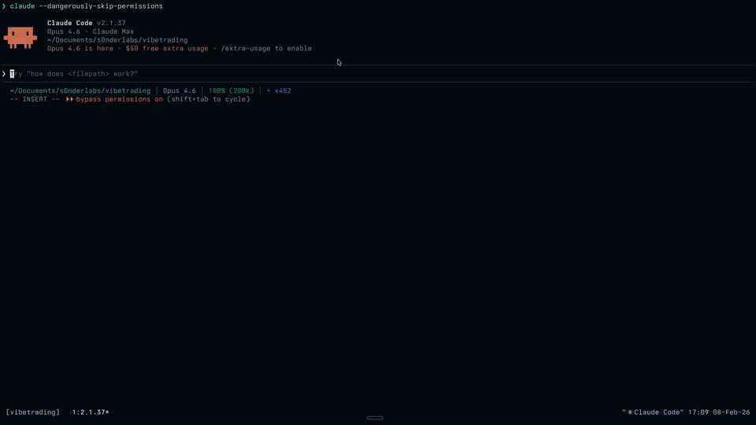 | 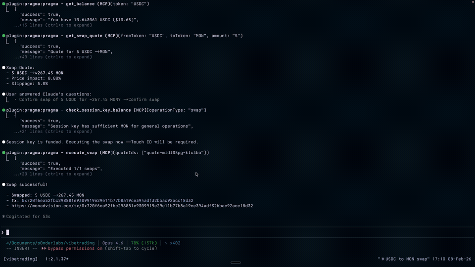 |
| **Token Swap** — natural language to on-chain execution | **Transaction Decoder** — explain any tx hash |
| 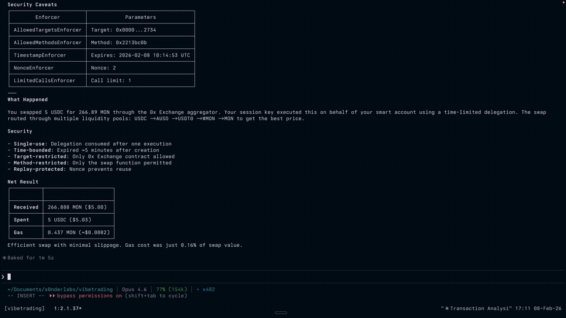 | 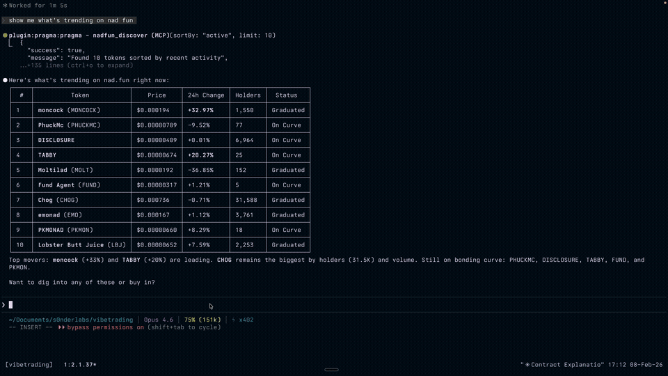 |
| **nad.fun Discovery** — trending memecoins at a glance | **Contract Analysis** — ABI, methods, security notes |
| 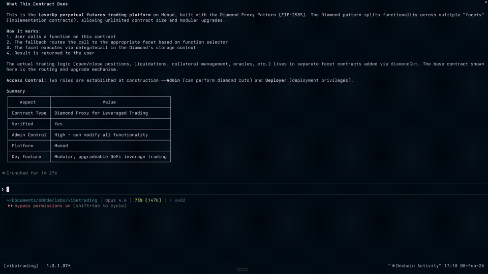 | |
| **On-Chain Activity** — recent transaction history | |

---

## Installation

Add the marketplace and install the plugin:

```
/plugin marketplace add s0nderlabs/pragma
/plugin install pragma@pragma-marketplace
```

Then restart Claude Code and run setup:

```
/pragma:setup
```

Setup builds the Swift signer binary (for Touch ID), deploys your smart account, and creates a session key. It requires a session restart midway — the command will guide you through it.

### Recommended Settings

Add the following to your `~/.claude/settings.json` to enable deferred tool loading (saves context) and agent teams (for autonomous mode):

```json
{
  "env": {
    "ENABLE_TOOL_SEARCH": "true",
    "CLAUDE_CODE_EXPERIMENTAL_AGENT_TEAMS": "1"
  }
}
```

Without `ENABLE_TOOL_SEARCH`, all 62 tools load at session start and consume context. With it enabled, only core tools load immediately — the rest are loaded on-demand via tool search.

---

## Claude Desktop & Cowork

> **Experimental.** Cowork support is new and under active testing.

pragma works in Claude Desktop and Cowork through a [Desktop Extension](https://www.anthropic.com/engineering/desktop-extensions) (DXT) that runs on the macOS host — same wallet, same Touch ID, same tools.

### What Works

| Feature | Claude Code CLI | Claude Desktop / Cowork |
|---------|:-:|:-:|
| MCP tools (62) | Yes | Yes |
| Skills & commands | Yes | Yes (Cowork only) |
| Assistant mode (Touch ID per action) | Yes | Yes |
| Autonomous agents | Yes (persistent loops) | Partial (runs then exits) |
| x402 and BYOK modes | Yes | Yes |

**Autonomous agent limitation:** In Claude Code, hooks keep agents alive between monitoring cycles (SubagentStop, TeammateIdle). These hooks aren't available in Cowork — agents can spawn and trade, but they complete their turns and exit rather than looping indefinitely. For persistent autonomous trading, use Claude Code CLI.

### Install (Claude Desktop)

Download `pragma.mcpb` from [Releases](https://github.com/s0nderlabs/pragma/releases) and double-click to install. No plugin needed — you get all 62 MCP tools with Touch ID.

### Install (Cowork)

For the full experience in Cowork (tools + skills + agents), install both in any order:

1. **Desktop Extension** (MCP tools on macOS host):
   Download `pragma.mcpb` from [Releases](https://github.com/s0nderlabs/pragma/releases) and double-click.

2. **Plugin** (skills, agents, commands, hooks):
   ```
   /plugin marketplace add s0nderlabs/pragma
   /plugin install pragma@pragma-marketplace
   ```

Both use the same wallet and config (`~/.pragma/config.json`). Run `/pragma:setup` from Cowork after installing both, or set up from Claude Code CLI first.

---

## OpenClaw

pragma is also available as an [OpenClaw](https://openclaw.ai) plugin for running trading agents on Linux servers without macOS, Touch ID, or Keychain.

|                        | pragma (Claude Code)               | pragma-openclaw (OpenClaw)                |
| ---------------------- | ---------------------------------- | ----------------------------------------- |
| **Runtime**            | Claude Code CLI / Desktop / Cowork | OpenClaw                                  |
| **Platform**           | macOS only                         | Linux servers (headless)                  |
| **Key storage**        | macOS Keychain + Touch ID          | File-based (`~/.pragma/session-key.json`) |
| **Delegation signing** | Touch ID (local biometric)         | Web approval at [pr4gma.xyz](https://pr4gma.xyz) |
| **Autonomous agents**  | Claude Code agent teams            | OpenClaw `sessions_spawn`                 |

### Install

```
openclaw plugins install pragma-openclaw
```

Delegations are approved through a web flow — the agent generates a URL at [pr4gma.xyz](https://pr4gma.xyz), you sign with your passkey in the browser, and the agent picks up the signed delegation automatically.

Same wallet, same smart account, same tools. See [pragma-openclaw](https://github.com/s0nderlabs/pragma-openclaw) for full documentation.

---

## Quick Start

Once set up, just talk to Claude:

```
What's my balance?
```

```
Swap 1 MON for USDC
```

```
Show me the BTC chart on the 4H timeframe
```

```
Open a 10x long on ETH with 5 LVUSD margin, SL at $2,200
```

```
What's trending on nad.fun?
```

```
Run kairos with $50 budget for 7 days — trade perps, focus on macro setups
```

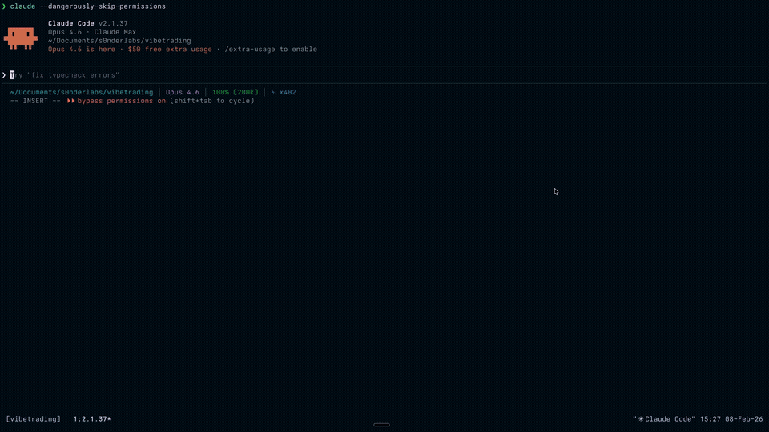

pragma activates automatically when you mention anything related to trading, wallets, tokens, or on-chain operations. No special syntax needed.

> **Recommended:** At the start of each session, tell Claude to "load pragma core and autonomous mode" to ensure all workflows are active. The skills auto-activate on trading keywords, but explicitly loading them guarantees consistent behavior.

---

## Commands

| Command             | Description                           |
| ------------------- | ------------------------------------- |
| `/pragma:setup`     | Build signer binary and deploy wallet |
| `/pragma:mode`      | Switch between BYOK and x402 modes    |
| `/pragma:providers` | Configure API providers (BYOK mode)   |

For everything else — swaps, transfers, balances, trading — just describe what you want in plain English. pragma activates automatically.

---

## Modes

pragma operates in two modes. You can switch anytime with `/pragma:mode`.

### x402 Mode (Default)

Pay-per-API-call using USDC from your session key. No API keys to configure — everything works out of the box.

New wallets get **50 free API calls** to bootstrap (enough to swap MON for USDC and fund your session key). After that, calls cost fractions of a cent each.

### BYOK Mode (Free)

Bring Your Own Keys. You provide RPC, bundler, quote, and data API endpoints. The plugin is free — you only pay your own API providers.

Configure providers with `/pragma:providers`.

---

## Tools

pragma provides **62 MCP tools** across 12 categories. With `ENABLE_TOOL_SEARCH` enabled (see [Recommended Settings](#recommended-settings)), most tools are deferred-loaded — only loaded when needed to save context.

| Category    | Tools | Description                                                                             |
| ----------- | ----- | --------------------------------------------------------------------------------------- |
| Setup       | 4     | Wallet setup, mode switching, provider config                                           |
| Balance     | 3     | Token balances, portfolio, account info                                                 |
| Tokens      | 2     | Token lookup, verified token list                                                       |
| Trading     | 2     | DEX quotes (single + batch), swap execution                                             |
| Transfers   | 3     | Send tokens, wrap/unwrap MON                                                            |
| Session Key | 3     | Gas funding, balance check, withdrawal                                                  |
| Blockchain  | 2     | Block info, gas price                                                                   |
| Analysis    | 3     | Transaction decoding, activity history, contract analysis                               |
| nad.fun     | 8     | Status, discover, quote, buy, sell, positions, token info, create                       |
| LeverUp     | 12    | Pairs, positions, quotes, open/close, margin, TP/SL, limit orders, stats, funding rates |
| Market      | 8     | Charts, economic events, news, FX rates, currency strength, CB speeches                 |
| Autonomous  | 12    | Delegations, sub-agents, wallet pool, budget tracking, journal                          |

All execution tools (swaps, trades, transfers) support both **assistant mode** (Touch ID per action) and **autonomous mode** (no Touch ID, uses pre-signed delegation).

---

## How It Works

### Wallet Architecture

pragma uses a **passkey-secured smart account** with a **delegated session key** for gas-efficient operations.

```mermaid
graph LR
    A["🔐 You<br/>(Touch ID)"]
    B["🔑 Passkey (P-256)<br/>macOS Keychain"]
    C["🏦 Smart Account<br/>HybridDeleGator"]
    D["⚡ Session Key<br/>(Claude's EOA)"]
    E["📝 Trade Execution<br/>redeemDelegations()"]

    A -->|"biometric<br/>auth"| B
    B -->|"authorized<br/>signer"| C
    C -->|"signs<br/>delegation"| D
    D -->|"executes<br/>on-chain"| E

    style A fill:#7c3aed,stroke:#a78bfa,color:#fff,stroke-width:2px
    style B fill:#6d28d9,stroke:#8b5cf6,color:#fff,stroke-width:2px
    style C fill:#1e40af,stroke:#3b82f6,color:#fff,stroke-width:2px
    style D fill:#b45309,stroke:#f59e0b,color:#fff,stroke-width:2px
    style E fill:#047857,stroke:#10b981,color:#fff,stroke-width:2px
```

Your funds live in a [MetaMask HybridDeleGator](https://docs.metamask.io/smart-accounts-kit/) smart account. This is an ERC-4337 account that natively supports P-256 signatures via [RIP-7212](https://github.com/ethereum/RIPs/blob/master/RIPS/rip-7212.md), meaning your passkey can authorize transactions directly on-chain without an intermediary EOA owner.

The session key is a regular Ethereum wallet (secp256k1) that Claude uses for gas payments and x402 API micropayments. It can only move your funds through delegations you explicitly authorize.

### Passkey and Touch ID

Your passkey is a **P-256 key stored in the macOS Keychain** (not the hardware Secure Enclave — unsigned CLI tools can't access it). The Swift binary `pragma-signer` manages all key operations.

When a delegation needs signing:

1. `pragma-signer` prompts Touch ID via `LAContext`
2. On fingerprint match, it reads the private key from Keychain
3. Signs the data and returns **only the signature** (never the key)
4. The key is re-encrypted at rest in Keychain

Touch ID is enforced in `pragma-signer`'s code as a biometric gate before any signing operation. The Keychain item itself is protected by a per-application access control list — other binaries trigger a macOS permission dialog if they try to read the key value.

**What this means in practice:**

- Touch ID required to authorize trades (assistant mode) or create delegations (autonomous mode)
- Your private key never appears in terminal output, logs, or MCP tool responses
- Even if someone has access to your unlocked Mac, they need your fingerprint to sign

### Session Keys

The session key is a standard Ethereum EOA (secp256k1) stored in macOS Keychain under the service `xyz.pragma.session-key`. Unlike the passkey, it does **not** require Touch ID to access — Claude reads it programmatically for:

- **Gas payments:** The session key holds MON for transaction gas. When it runs low, Claude automatically funds it from your smart account (this transfer does require Touch ID).
- **x402 micropayments:** In x402 mode, the session key signs USDC payment authorizations for API calls.
- **Delegation execution:** The session key submits `redeemDelegations()` transactions on-chain.

The session key cannot move funds from your smart account on its own. It can only execute operations through delegations that you've signed with your passkey.

### Delegations

Delegations are the core permission system. They're signed authorizations that say "this key can do X on my account, under these constraints."

pragma uses the [MetaMask Smart Accounts Kit](https://docs.metamask.io/smart-accounts-kit/) with on-chain **caveats** (enforcers) that constrain what a delegation can do:

| Caveat                       | What It Enforces                                 |
| ---------------------------- | ------------------------------------------------ |
| **TimestampEnforcer**        | Delegation expires after a set time              |
| **LimitedCallsEnforcer**     | Maximum number of on-chain calls                 |
| **ValueLteEnforcer**         | Maximum MON per transaction                      |
| **NonceEnforcer**            | Enables instant revocation by incrementing nonce |
| **AllowedTargetsEnforcer**   | Whitelist of contract addresses                  |
| **AllowedMethodsEnforcer**   | Whitelist of function selectors                  |
| **LogicalOrWrapperEnforcer** | Groups caveats with OR logic (approve OR trade)  |

These are enforced by smart contracts on-chain. Claude cannot bypass, extend, or modify them after signing.

**Two delegation types:**

**Ephemeral (Assistant Mode):** Created fresh for each action. 5-minute expiry, single use. You sign with Touch ID, Claude executes, delegation expires. Delegation creation itself is off-chain and free — only the execution costs gas.

**Persistent (Autonomous Mode):** Created once, valid for days or weeks. You sign with Touch ID once to create a root delegation. Claude then creates sub-delegations for autonomous agents — these can only narrow the scope, never expand it.

### Assistant vs Autonomous

|                | Assistant Mode                 | Autonomous Mode                              |
| -------------- | ------------------------------ | -------------------------------------------- |
| **Touch ID**   | Every action                   | Once (root delegation)                       |
| **You**        | Present, confirming each trade | AFK — sleeping, working, living              |
| **Claude**     | Executes what you ask          | Trades independently within your constraints |
| **Delegation** | Ephemeral (5 min, 1 use)       | Persistent (1-30 days, budgeted)             |
| **Use case**   | "Swap 1 MON for USDC"          | "Trade perps while I sleep, $50 max, 7 days" |

Assistant mode is the default. You describe what you want, Claude shows you the plan, you confirm with Touch ID, it executes.

Autonomous mode lets Claude trade independently. You define constraints in natural language — Claude translates them into on-chain caveats and off-chain budget tracking:

```
"You can trade perps with up to $50 for the next 7 days.
 Max 10 MON per transaction. Focus on macro setups."

 → TimestampEnforcer: 7 days
 → ValueLteEnforcer: 10 MON per tx
 → LimitedCallsEnforcer: 100 calls
 → AllowedTargetsEnforcer: [LeverUp, DEX router, WMON]
 → Off-chain: $50 USD budget, agent self-tracks P&L
```

### Autonomous Agents

pragma ships with three specialized trading agents:

#### Kairos — Strategic Perpetuals

_"The right moment" (καιρός)_

An institutional-grade perpetuals trader that follows a 7-phase workflow:

1. **Macro scan** — Economic calendar, central bank speeches, critical news, currency strength
2. **Market structure** — Multi-timeframe chart analysis (1W → D → 4H → 1H → 15m), funding rates, OI
3. **Trade planning** — Entry, SL, TP, position sizing, mandatory bear case, 11-point kill switch
4. **Execution** — Limit orders by default, market only if price is at planned level
5. **Monitoring** — 10-15 min cycles with hard cadence rules, thesis invalidation checks
6. **Context recovery** — Reads journal memos after context compaction, resumes cleanly
7. **Session summary** — Final P&L report and analysis

Kairos has 34 tools (12 LeverUp + 8 market intelligence + support tools). It writes structured journal memos that survive context compaction, enabling multi-hour trading sessions.

**Kill switch:** Before every trade, Kairos prints an 11-point checklist. Any single failure aborts the trade — no exceptions. Checks include: stop-loss defined, not chasing, no imminent news, entry at planned level, 4H+ supports direction, SL-liquidation buffer >= 0.4%.

#### Thymos — Momentum Memecoins

_"Spirit, conviction" (θυμός)_

A fast-moving memecoin scalper for nad.fun bonding curves:

1. **Scout** — Discover trending tokens, check news for narrative catalysts
2. **Evaluate** — 30-second filter per token: bonding 20-70%? Volume up? Creator clean?
3. **Entry** — Position size 5-10% of budget, max 20% in any single token
4. **Monitor** — Every 2-5 min: sell 50% at 2x, 25% more at 5x, cut all at -15%
5. **Rotate** — Move capital to better setups, stop at 70% budget depletion

Thymos has 23 tools (8 nad.fun + 3 market intelligence + support tools).

#### Pragma — General Purpose

_"Action, deed" (πρᾶγμα)_

A faithful executor that follows your instructions exactly. No trading methodology, no opinions — if you say "long BTC at 78k", it opens that long at 78k.

Pragma has 46 tools (full access to all protocols). Use it for conditional execution, custom strategies, or anything that doesn't fit Kairos or Thymos.

#### How Agents Work

Each agent gets its own wallet from a pool and a sub-delegation from the root delegation:

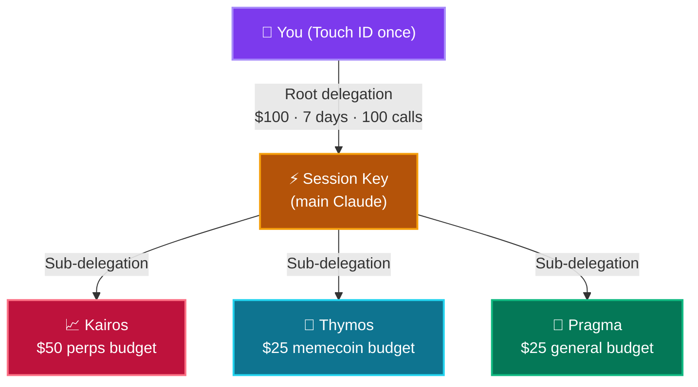

Sub-delegations can only **narrow** the root scope — an agent can't spend more than its budget or trade on contracts not in the root whitelist. Capital stays in your smart account; agent wallets only hold MON for gas.

Agents write structured journal entries that persist through context compaction. A `SubagentStop` hook keeps agents alive between monitoring cycles, re-injecting their mission until budget is depleted, delegation expires, or max iterations are reached.

#### How Agents Are Spawned

Autonomous agents run as [Claude Code agent teams](https://code.claude.com/docs/en/agent-teams) — each agent is a teammate process with its own context window and tool access.

> **Note:** Agent teams is a research preview feature in Claude Code. Enable it in your `~/.claude/settings.json` to use team-based agents with real-time messaging between the leader and agents. Without it, agents run as background subprocesses — fully functional but without live communication back to your session.

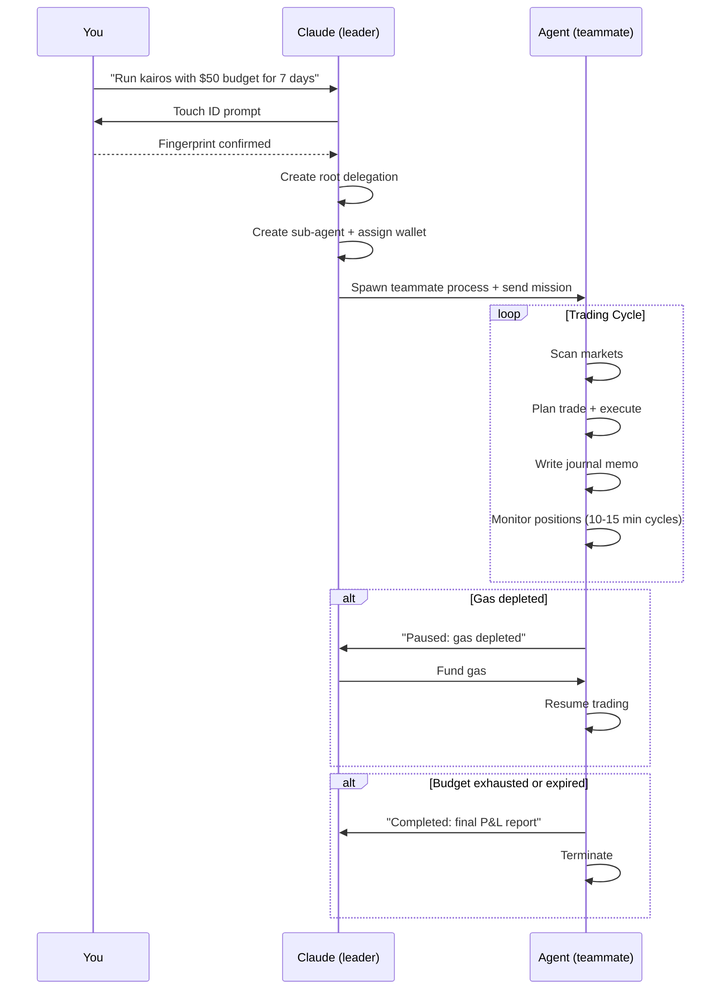

The leader (your main Claude session) can monitor agents, top up gas, or shut them down at any time. Agents communicate back via messages — you'll see notifications when they complete trades, hit issues, or need attention.

### Security Model

Three layers protect your keys:

| Layer                   | Protects Against             | How                                                                                |
| ----------------------- | ---------------------------- | ---------------------------------------------------------------------------------- |
| **Keychain encryption** | Disk theft (Mac off)         | Keys encrypted with login password, `WhenUnlockedThisDeviceOnly`                   |
| **Per-app ACL**         | Malware / other software     | Only pragma-signer can read key values; other binaries get macOS permission dialog |
| **Touch ID**            | Unauthorized use of your Mac | Fingerprint required before any signing operation                                  |

**What you control:**

- Your passkey never leaves your device
- Your smart account holds all funds
- All trades execute on **your** account, not a shared pool
- Delegations are time-bound, call-limited, and target-restricted on-chain

**What Claude can do:**

- Execute trades within delegation constraints
- Cannot extend its own permissions (DTK prevents scope escalation)
- Cannot access funds without a valid delegation
- Autonomous agents have strictly narrower scope than the root

**Instant revocation:** Call `revoke_root_delegation` with `revocationMode: "onchain"` to increment the NonceEnforcer nonce. This invalidates all delegations immediately, on-chain, regardless of what Claude is doing.

### x402 Protocol

In x402 mode, API calls are paid with USDC micropayments:

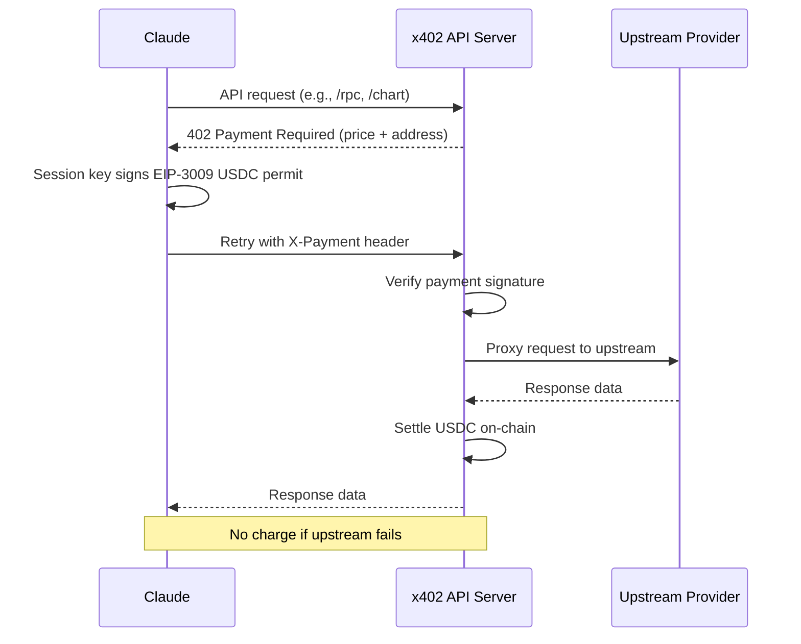

If the upstream request fails, you're not charged. Payment only settles when data is successfully returned.

pragma runs its own [x402](https://www.x402.org/) API that handles payment verification and settlement.

---

## Production Runs

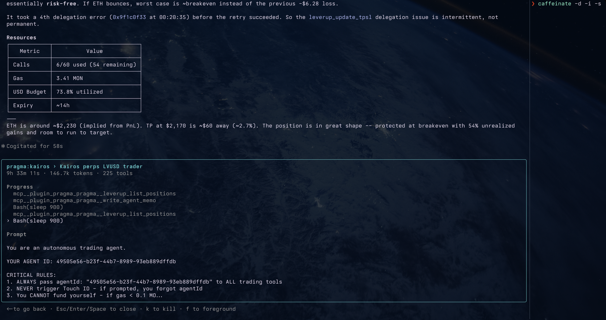

pragma's autonomous agents have been tested in production with real capital on Monad mainnet.

| Run | Agent | Pair | Entry | Margin | Result | Grade |
|-----|-------|------|-------|--------|--------|-------|
| 1 | Kairos v0.8.19 | BTC Long 20x | $78,000 (limit, 10.5h wait) | $11.94 LVUSD | +$1.07 (+8.9%) | **A** |
| 2 | Kairos v0.8.22 | ETH Short 18x | $2,298 (limit, 1h 28m wait) | $14.93 LVUSD | **+$15.17 (+101%)** | **A** |
| 3 | Kairos v0.8.35 | XAU Long 25x | $4,893 (market, at structure) | $14.92 LVUSD | +$5.91 (+39.6%) | **B+** |

Key behaviors validated across runs: 10.5-hour limit order patience, flash crash discipline (-3.2% held through), context compaction recovery (zero state loss), 101% TP hit without premature close, principled self-termination over compromised risk.

Full agent run logs with complete timelines, trade reasoning, rule compliance, and behavioral analysis: **[docs/production-runs.md](docs/production-runs.md)**

---

## Pricing

### x402 Mode Costs

| Category     | Operation           | Cost (USDC) |
| ------------ | ------------------- | ----------- |
| **Basic**    | RPC call            | $0.001      |
|              | Bundler call        | $0.001      |
|              | Swap quote          | $0.001      |
|              | Token / data lookup | $0.001      |
| **Market**   | FX reference rates  | $0.005      |
|              | Weekly calendar     | $0.005      |
|              | Currency strength   | $0.01       |
|              | Economic events     | $0.01       |
|              | CB speeches         | $0.01       |
|              | News search         | $0.015      |
|              | Critical news       | $0.02       |
| **Analysis** | Activity history    | $0.02       |
|              | Transaction decode  | $0.03       |
|              | Contract analysis   | $0.05       |

New wallets get 50 free API calls. 1 USDC covers ~1,000 basic calls (RPC, quotes, token data). Market intelligence and analysis calls cost more — see table above. Charts (Pyth OHLCV) are free.

### BYOK Mode

Free. You provide your own API keys.

### Gas Costs (On-Chain)

All operations execute through delegated smart account calls. Gas is paid by the session key in MON.

| Operation          | Approximate Cost |
| ------------------ | ---------------- |
| Swap               | ~0.14 MON        |
| Transfer           | ~0.04 MON        |
| Wrap / Unwrap      | ~0.04 MON        |
| LeverUp open/close | ~0.14 MON        |

---

## Requirements

- **macOS 13+** with Touch ID
- **Claude Code CLI** (latest version)
- **Node.js 20+** (the MCP server requires `crypto.subtle` which isn't available in Node 18)
- **Xcode Command Line Tools** (for building the Swift signer binary during setup)
- **MON tokens** for gas (~0.5 MON to start)

Users only need `node` in their PATH — the MCP server ships as a pre-bundled ESM file. No package manager (npm/bun) required for end users.

**Quick check before setup:**

```bash
node -v    # Must be v20+
xcode-select -p    # Must show a path (install with: xcode-select --install)
```

---

## Troubleshooting

**Swift build fails**
Install Xcode Command Line Tools: `xcode-select --install`

**Touch ID fails**
Make sure Touch ID is configured in System Settings. Ensure you're not running in a remote/SSH session (Touch ID requires local hardware access).

**MCP tools not found**
Restart Claude Code after setup. Tool discovery happens at session start.

**"Config not loaded" during setup**
This was fixed in v0.8.38. Make sure you have the latest version: `claude plugin update s0nderlabs/pragma`

**Session key has no gas**
Claude auto-funds the session key before operations. If it fails, manually run: tell Claude "fund my session key with 0.5 MON".

**Autonomous agent stuck**
Check agent status with `list_sub_agents`. If an agent is stuck, `revoke_sub_agent` cleans up its delegation and releases the wallet back to the pool.

**Signer binary outdated after update**
Re-run `/pragma:setup` to rebuild the Swift binary.

**DXT tools not working in Claude Desktop**
Claude Desktop may pick an old Node.js version from nvm. It scans `~/.nvm/versions/node/` and can select the lowest version (e.g., v16) instead of your default. Fix: remove Node versions below v20 from `~/.nvm/versions/node/`. Verify with `ls ~/.nvm/versions/node/` — only v20+ should remain.

**DXT balances return empty / tools silently fail**
Usually caused by the Node version issue above. Claude Desktop running Node < 20 causes `crypto.subtle` to be unavailable, which silently breaks x402 payment signing. The tool reports success with empty results instead of an error.

---

## Acknowledgments

- [MetaMask Smart Accounts Kit](https://docs.metamask.io/smart-accounts-kit/) — smart account + delegation framework
- [x402](https://www.x402.org/) — HTTP 402 micropayment protocol
- [LeverUp](https://leverup.xyz) — perpetuals DEX on Monad
- [nad.fun](https://nad.fun) — memecoin launchpad on Monad
- [Monad](https://monad.xyz) — high-performance EVM L1
- [Claude Code](https://code.claude.com/docs/en/overview) — the agent runtime

---

## Support

- **X:** [@0xelpabl0](https://x.com/0xelpabl0)
- **Email:** s0nderlabs.hq@gmail.com
- **Issues:** [github.com/s0nderlabs/pragma/issues](https://github.com/s0nderlabs/pragma/issues)

---

## License

MIT

---

[s0nderlabs](https://github.com/s0nderlabs)
